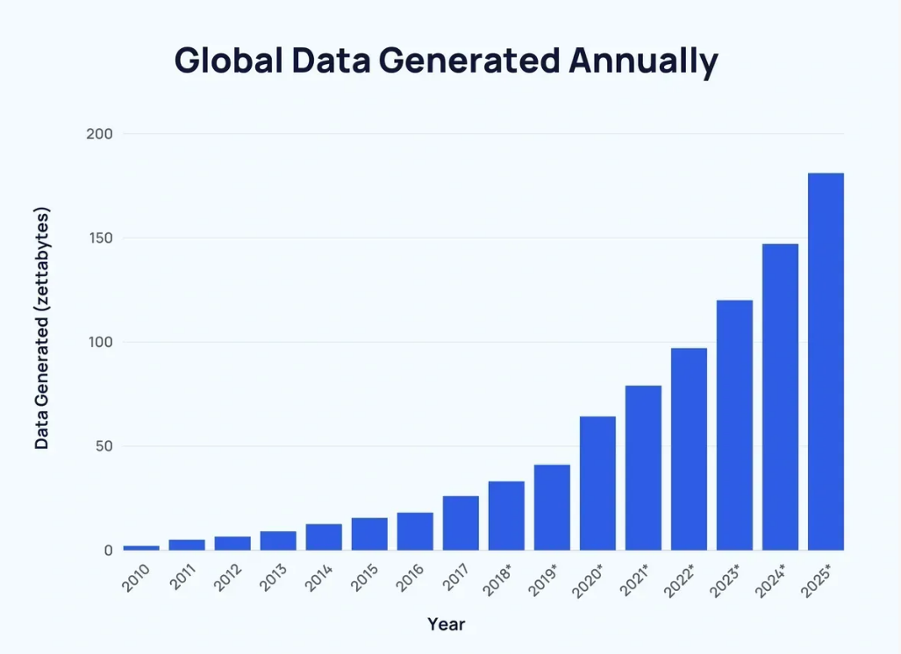

<h1 align="center">
  <!--   -->
  Recommendation System built with Python
</h1>

<b>We are in the midst of a new Renaissance right now, and the reason for it is data!</b> 
In the last 10 years, we have created more data than in the entire previous history of the human race. In face of this huge amount of data, we often have a hard time making a simple decision. That's what is called the <i>Paradox of Choice.</i>

## Stack

<!-- Linguagens -->

<h3><b>Estimated Effort: 7 min</b></h3>
<h1 align="center">
  
</h1>

A script that reads a dataset of movie ratings and then recommends new movies for a user.

### Author: Antônio Biasotti