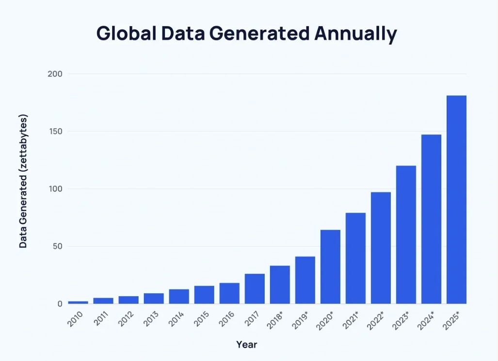

<h1 align="center">
  <!--   -->
  Recommendation System built with Python
</h1>

<!-- Linguagens -->

<h3><b>Estimated Effort: 7 min</b></h3>
<h1 align="center">
  
</h1>

### We are in the midst of a new Renaissance right now, and the reason for it is data!
In the past 2 years, we have created more data than in the entire previous history of the human race. In face of this tremendous amount of data, we often find ourselves having a hard time making a simple decision. This uncertainty is often called <i>The Paradox of Choice</i>, in which we can't make up our minds due to the fact that there are so manny choices! 
To solve this problem, recommendation engines were created. 
Basically, there are two main types of Recommender Systems: 
- Collaborative: Predicts what you like based on what other similar user have liked in the past;
- Content-based: Predicts what you like based on what you liked in the past.

Netflix, for instance, combines this two approaches.

In this project I created a simple script that reads a dataset of movie ratings and then recommends new movies for a user.

#### Author: Antônio Biasotti